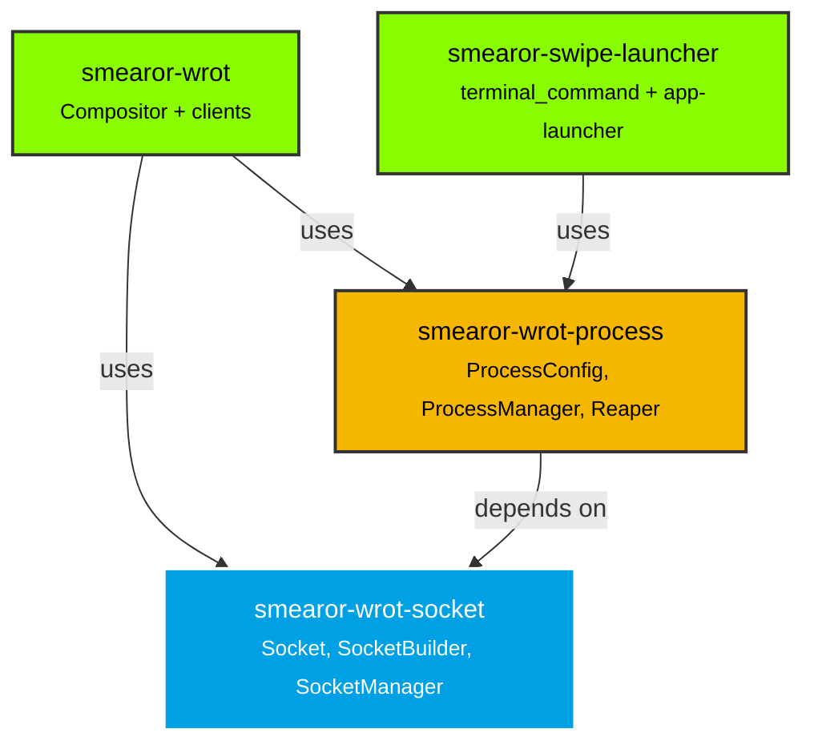
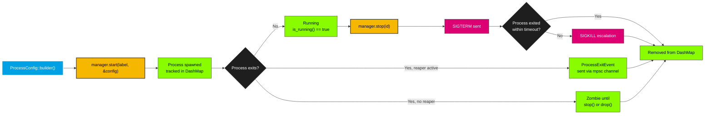
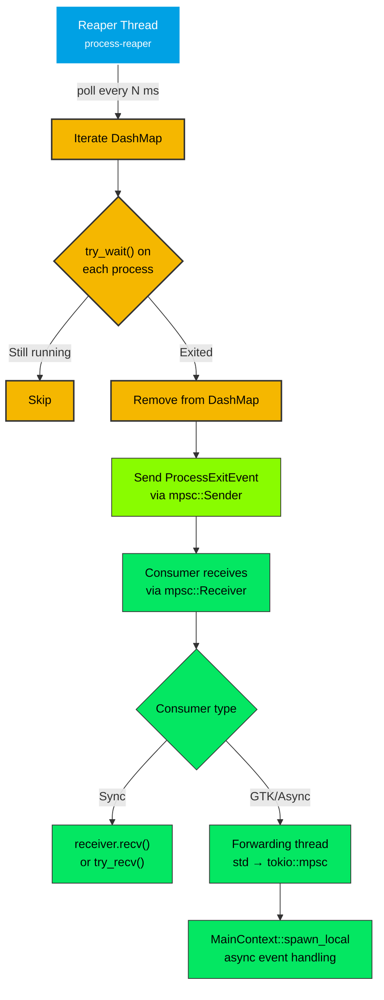
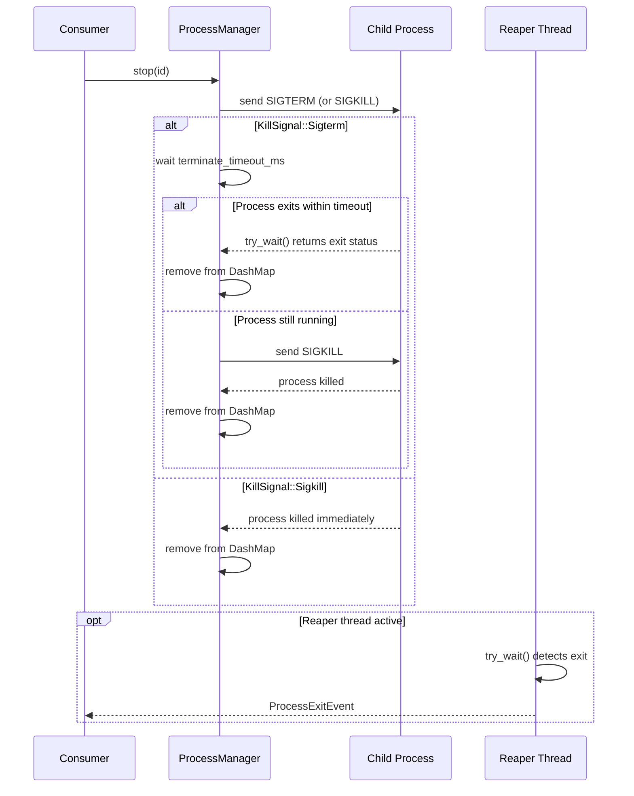
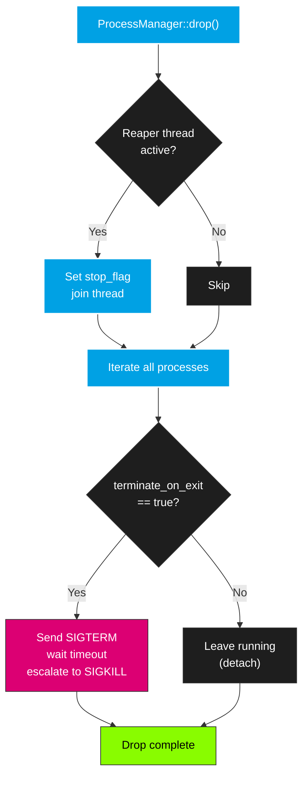

# Architecture

`smearor-wrot-process-manager` achieves its socket and process management through two crates working together with `DashMap`-based concurrent tracking and an optional reaper thread.

## Overview

The workspace is composed of two crates:

- **`smearor-wrot-socket`** — Wayland socket path management with `Socket`, `SocketBuilder`, and `SocketManager`
- **`smearor-wrot-process`** — Child process lifecycle management with `ProcessConfig`, `ProcessManager`, and reaper thread

## Crate Relationships

## Core Components

### 1. Socket Management (`smearor-wrot-socket`)

The socket crate provides three main types:

- **`Socket`** — A `PathBuf` newtype representing a Wayland socket path. Implements `Deref<Target = Path>`, `Display`, `AsRef<OsStr>`, and `AsRef<str>`.
- **`SocketBuilder`** — Constructs socket paths in `XDG_RUNTIME_DIR`. If a name is provided, it validates uniqueness. If no name is provided, it auto-generates a unique name like `wayland-{N}`.
- **`SocketManager`** — A concurrent multi-socket manager using `DashMap`. Sockets are registered by name and can be retrieved, removed, or listed. Shareable via `Arc` across threads.

### 2. Process Management (`smearor-wrot-process`)

The process crate provides the `ProcessManager` as its central component:

- **`ProcessConfig`** — Built via `TypedBuilder`. Contains all configuration for spawning a child: command, args, env, working_dir, shell mode, forked mode, terminate_on_exit, kill_signal, terminate_timeout, restart_on_exit, stdio config, and optional Wayland socket.
- **`ProcessManager`** — Tracks child processes in a `DashMap` keyed by `ProcessId`. Supports label-based grouping, concurrent start/stop operations, and an optional reaper thread.
- **`Process`** — A handle to a managed child process. Contains the `ProcessId`, PID, label, config, and the `std::process::Child` handle.
- **`ProcessExitEvent`** — Emitted by the reaper thread when a process exits. Contains `id`, `pid`, `label`, and `restart_on_exit` flag.

## Process Lifecycle

## Reaper Thread Architecture

## Termination Flow

## Drop Behavior

When `ProcessManager` is dropped, the following sequence occurs:

## Design Decisions

### Why split socket and process into separate crates?

Socket management is a lightweight concern (path manipulation, `DashMap` for multi-socket support). Process management is heavier (child spawning, signal handling, reaper threads). Separating them allows consumers to depend on only what they need — `smearor-swipe-launcher` uses only `smearor-wrot-process` without needing the socket crate directly.

### Why `DashMap` instead of `Mutex<HashMap>`?

Both `SocketManager` and `ProcessManager` are accessed concurrently from multiple threads. `DashMap` provides shard-level locking, avoiding the contention of a single `Mutex`. The reaper thread iterates processes while the main thread may start/stop others — `DashMap` handles this without blocking.

### Why `std::sync::mpsc` for reaper events?

The reaper thread is a plain `std::thread`, not async. `std::sync::mpsc::Sender` is `Send + Sync` and integrates cleanly with both sync and async consumers. In GTK applications, a forwarding thread bridges the blocking `recv()` to a non-blocking `tokio::sync::mpsc` channel for use in `MainContext::spawn_local`. This avoids blocking the GTK main loop while keeping the reaper thread simple.

### Why `typed-builder` for `ProcessConfig`?

`ProcessConfig` has many fields with sensible defaults. `typed-builder` enforces required fields (only `command`) at compile time while keeping optional fields ergonomic with `.field_name(value)` syntax. This prevents missing-field bugs without runtime validation.

### Why not `tokio::process::Child`?

The `ProcessManager` is deliberately synchronous. It works with GTK's `MainContext` and Smithay's event loop without requiring an async runtime. The reaper thread uses non-blocking `try_wait()` polling instead — simpler, no runtime dependency, and sufficient for the use case (exit detection with configurable latency).

### Why `setsid()` instead of double-fork?

`setsid()` detaches the process from the controlling terminal. A double-fork (grandchild) would lose the `Child` handle, preventing tracking and `try_wait()` reaping. With `setsid()`, the process is still a direct child — the `Child` handle is stored, `try_wait()` works, and `stop()` can send signals. This is the correct trade-off for a process manager that needs to track and terminate its children.
