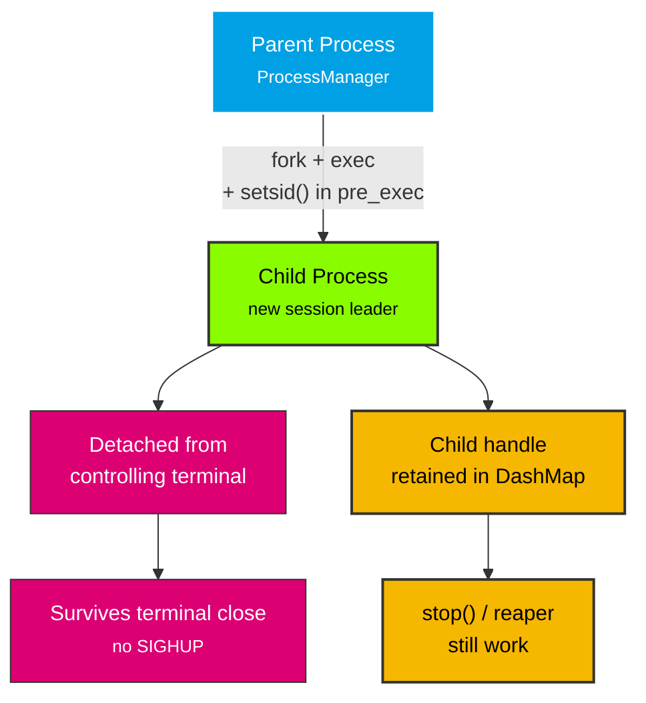

# Forked / Detached Process

Spawn a process that is detached from the parent's controlling terminal via `setsid()`.

## Overview

When `forked = true` is set in `ProcessConfig`, `ProcessManager::start()` adds a `pre_exec` hook that calls `setsid()`. This detaches the child process from the parent's controlling terminal, making it suitable for daemons and background services that should survive terminal close.

Unlike a double-fork (which would create a grandchild and lose the `Child` handle), `setsid()` keeps the process as a direct child. This means:

- The `Child` handle is retained in the `DashMap`
- `try_wait()` works for reaping and `is_running()` checks
- `stop()` / `stop_label()` can still terminate it
- The reaper thread can detect its exit



## Example

```rust
use process_manager::{ProcessConfig, ProcessManager, StdioConfig};

let manager = ProcessManager::new();
let config = ProcessConfig::builder()
    .command("my-daemon".to_string())
    .forked(true)
    .terminate_on_exit(true)
    .stdin(StdioConfig::Null)
    .stdout(StdioConfig::Null)
    .stderr(StdioConfig::Null)
    .build();

let id = manager.start("daemon", &config)?;
```

## When to Use `forked`

- **Daemons** — Processes that should run independently of the parent's terminal session
- **Terminal applications** — Processes that should not receive `SIGHUP` when the parent terminal closes
- **Long-running services** — Processes that outlive the parent and should not be tied to the parent's session

## When NOT to Use `forked`

- **Compositor clients** — Wayland clients should share the compositor's session
- **Short-lived commands** — No need to detach processes that finish quickly
- **Processes you want to receive terminal signals** — `setsid()` detaches from the terminal, so terminal-generated signals (Ctrl+C, SIGHUP) won't reach the child
