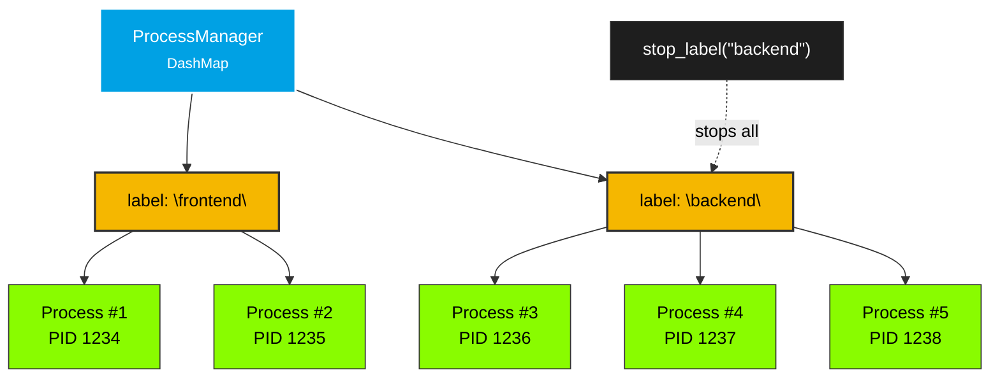

# Label-based Grouping

Start and stop multiple processes under a shared label.

## Overview

Labels provide a way to group related processes. Multiple processes can share the same label, and operations like `stop_label()` and `pids_by_label()` act on all processes with that label. This is useful for:

- **Worker pools** — Start N workers under a shared label, stop them all at once
- **Application groups** — Group auxiliary processes (e.g. a main app + its helpers)
- **Service management** — Start/stop services by name rather than tracking individual `ProcessId`s

Labels are **not** unique identifiers — multiple processes can share the same label. Use `ProcessId` for individual process operations and labels for grouped operations.



## Example

```rust
use smearor_wrot_process::{ProcessConfig, ProcessManager, StdioConfig};

let manager = ProcessManager::new();
let config = ProcessConfig::builder()
    .command("worker".to_string())
    .stdout(StdioConfig::Null)
    .build();

// Start multiple workers under the same label
manager.start("worker-pool", &config)?;
manager.start("worker-pool", &config)?;
manager.start("worker-pool", &config)?;

// Check all PIDs for the label
let pids = manager.pids_by_label("worker-pool");
assert_eq!(pids.len(), 3);

// Stop all workers in the pool at once
manager.stop_label("worker-pool")?;
assert!(manager.is_empty());
```

## Querying by Label

| Method | Returns | Description |
|--------|---------|-------------|
| `pids_by_label(label)` | `Vec<u32>` | All PIDs for processes with this label |
| `get_by_label(label)` | `Vec<Process>` | All processes with this label |
| `labels()` | `Vec<String>` | All distinct labels currently registered |

## Mixed Labels

You can have multiple labels active at the same time:

```rust
manager.start("frontend", &frontend_config)?;
manager.start("frontend", &frontend_config)?;
manager.start("backend", &backend_config)?;
manager.start("backend", &backend_config)?;
manager.start("backend", &backend_config)?;

assert_eq!(manager.pids_by_label("frontend").len(), 2);
assert_eq!(manager.pids_by_label("backend").len(), 3);
assert_eq!(manager.labels().len(), 2);

// Stop only the backend
manager.stop_label("backend")?;
assert_eq!(manager.pids_by_label("frontend").len(), 2);
assert!(manager.pids_by_label("backend").is_empty());
```
