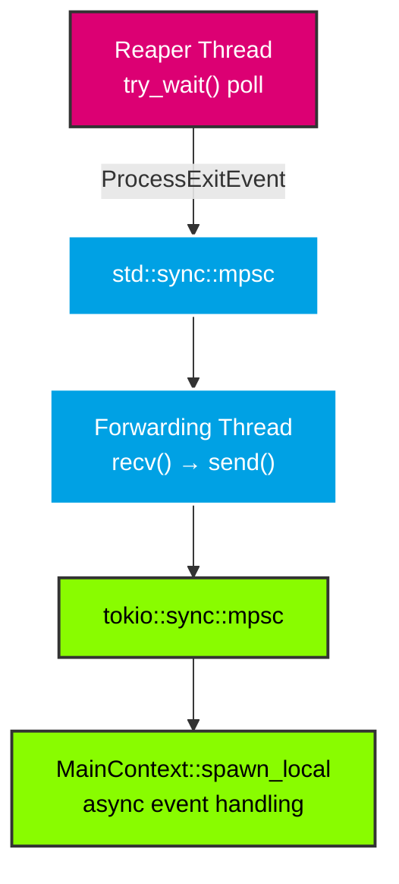

# Reaper Monitoring

Use the reaper thread to detect process exits and implement restart logic.

## Overview

The reaper thread polls `try_wait()` on all tracked processes at a configurable interval. When a process exits, it emits a `ProcessExitEvent` through an `mpsc` channel. This enables:

- **Zombie prevention** — Exited processes are reaped automatically
- **Exit notifications** — The consumer is informed when processes exit
- **Restart logic** — The consumer can restart crashed processes

## Basic Exit Detection

```rust
use process_manager::{ProcessConfig, ProcessManager, StdioConfig};
use std::time::Duration;

let (sender, receiver) = std::sync::mpsc::channel();
let manager = ProcessManager::with_reaper(Duration::from_secs(2), sender)?;

let config = ProcessConfig::builder()
    .command("short-lived".to_string())
    .stdout(StdioConfig::Null)
    .build();

manager.start("task", &config)?;

// Receive exit event (blocks until process exits or timeout)
let event = receiver.recv_timeout(Duration::from_secs(10))?;
println!("Process {} (PID {}) exited: {}", event.label, event.pid, event.state);
```

## Restart on Exit

```rust
let config = ProcessConfig::builder()
    .command("my-service".to_string())
    .restart_on_exit(true)
    .stdout(StdioConfig::Null)
    .build();

manager.start("service", &config)?;

// In your event loop:
if let Ok(event) = receiver.try_recv() {
    if event.restart_on_exit || event.state == ProcessState::Crashed {
        // Restart the process with the same label and config
        manager.start(&event.label, &config)?;
    }
}
```

## GTK Integration

In GTK applications, **do not** call `receiver.recv()` directly in `MainContext::spawn_local` — it is a blocking call that will freeze the GTK main loop. Instead, use a forwarding thread to bridge the blocking `std::sync::mpsc` to a non-blocking `tokio::sync::mpsc` channel:

```rust
use tokio::sync::mpsc::unbounded_channel;
use gtk4::glib::MainContext;

let (event_tx, mut event_rx) = unbounded_channel();
std::thread::spawn(move || {
    while let Ok(event) = receiver.recv() {
        if event_tx.send(event).is_err() {
            break; // Async receiver dropped — exit thread
        }
    }
});

MainContext::default().spawn_local(async move {
    while let Some(event) = event_rx.recv().await {
        println!("Process {} exited: {}", event.label, event.state);
        if event.restart_on_exit || event.state == ProcessState::Crashed {
            // Restart in main thread
        }
    }
});
```

## Event Flow Diagram



## Graceful Shutdown

The forwarding thread terminates automatically when:

1. `ProcessManager` is dropped → reaper stops → `mpsc::Sender` dropped → `recv()` returns `Err`
2. `MainContext` task completes → `event_rx` dropped → `event_tx.send()` returns `Err`

No explicit join is needed — the forwarding thread exits cleanly in both cases.
