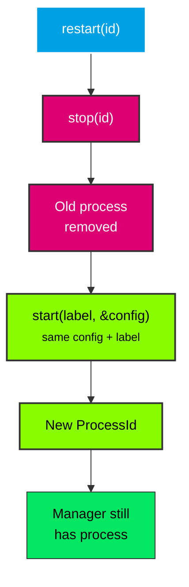

# Restart

Restart a process while preserving its config and label.

## Overview

`ProcessManager::restart(id)` stops the process (with escalation) and starts a new one with the same config and label. It returns the new `ProcessId`. `restart_label(label)` does the same for all processes under a label.



## Example

```rust
use process_manager::{ProcessConfig, ProcessManager, StdioConfig};

fn main() -> Result<(), Box<dyn std::error::Error>> {
    let manager = ProcessManager::new();

    let config = ProcessConfig::builder()
        .command("sleep".to_string())
        .args(vec!["10".to_string()])
        .stdout(StdioConfig::Null)
        .stderr(StdioConfig::Null)
        .build();

    let id = manager.start("worker", &config)?;
    println!("Started worker (PID {})", manager.get_pid(id).unwrap());

    // Restart - stops the old process, starts a new one with same config+label
    let new_id = manager.restart(id)?;
    println!("Restarted worker (new PID {})", manager.get_pid(new_id).unwrap());
    assert_ne!(id, new_id);

    // Clean up
    manager.stop(new_id)?;
    println!("Manager empty: {}", manager.is_empty());

    Ok(())
}
```

## Label-based Restart

```rust
use process_manager::{ProcessConfig, ProcessManager, StdioConfig};

let manager = ProcessManager::new();
let config = ProcessConfig::builder()
    .command("sleep".to_string())
    .args(vec!["10".to_string()])
    .stdout(StdioConfig::Null)
    .stderr(StdioConfig::Null)
    .build();

// Start a pool of 3 workers
for _ in 0..3 {
    manager.start("worker-pool", &config)?;
}

// Restart all workers in the pool
manager.restart_label("worker-pool")?;
```

## Running the Example

```sh
cargo run --example restart
```
