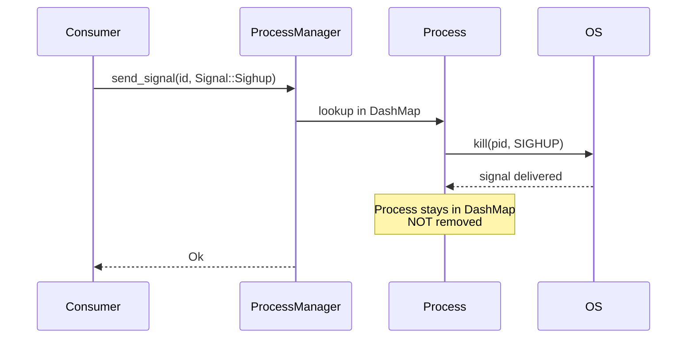

# Send Signal

Send arbitrary Unix signals to running processes without stopping them.

## Overview

The `send_signal()` and `send_signal_label()` methods allow sending any [`Signal`](../process/signal.md) to a managed process. Unlike `stop()`, the process remains in the manager — this is useful for:

- **Config reloads** — Send `SIGHUP` to trigger a reload
- **Pause/resume** — Send `SIGSTOP` / `SIGCONT`
- **Custom protocols** — Send `SIGUSR1` / `SIGUSR2` for application-specific events
- **Window resize** — Send `SIGWINCH` to notify terminal applications



## Example

```rust
use smearor_wrot_process::{ProcessConfig, ProcessManager, Signal, StdioConfig};

fn main() -> Result<(), Box<dyn std::error::Error>> {
    let manager = ProcessManager::new();

    let config = ProcessConfig::builder()
        .command("sleep".to_string())
        .args(vec!["30".to_string()])
        .stdout(StdioConfig::Null)
        .stderr(StdioConfig::Null)
        .build();

    let id = manager.start("target", &config)?;
    println!("Started process with ID {} (PID {})", id, manager.get_pid(id).unwrap());
    assert_eq!(manager.is_running(id), Some(true));

    // Send SIGWINCH — sleep ignores it, process keeps running
    manager.send_signal(id, Signal::Sigwinch)?;
    std::thread::sleep(std::time::Duration::from_millis(100));
    assert_eq!(manager.is_running(id), Some(true));
    println!("After SIGWINCH: still running");

    // Send SIGTERM — sleep terminates
    manager.send_signal(id, Signal::Sigterm)?;
    std::thread::sleep(std::time::Duration::from_millis(200));
    assert_eq!(manager.is_running(id), Some(false));
    println!("After SIGTERM: process exited");

    manager.stop(id)?;
    println!("Manager empty: {}", manager.is_empty());
    Ok(())
}
```

## Label-based Signaling

Send a signal to all processes sharing a label:

```rust
use smearor_wrot_process::{ProcessConfig, ProcessManager, Signal, StdioConfig};

let manager = ProcessManager::new();
let config = ProcessConfig::builder()
    .command("my-worker".to_string())
    .stdout(StdioConfig::Null)
    .stderr(StdioConfig::Null)
    .build();

// Start a pool of 4 workers
for _ in 0..4 {
    manager.start("worker-pool", &config)?;
}

// Send SIGHUP to all workers to trigger a config reload
manager.send_signal_label("worker-pool", Signal::Sighup)?;
```

## Running the Example

```sh
cargo run --example send_signal
```
