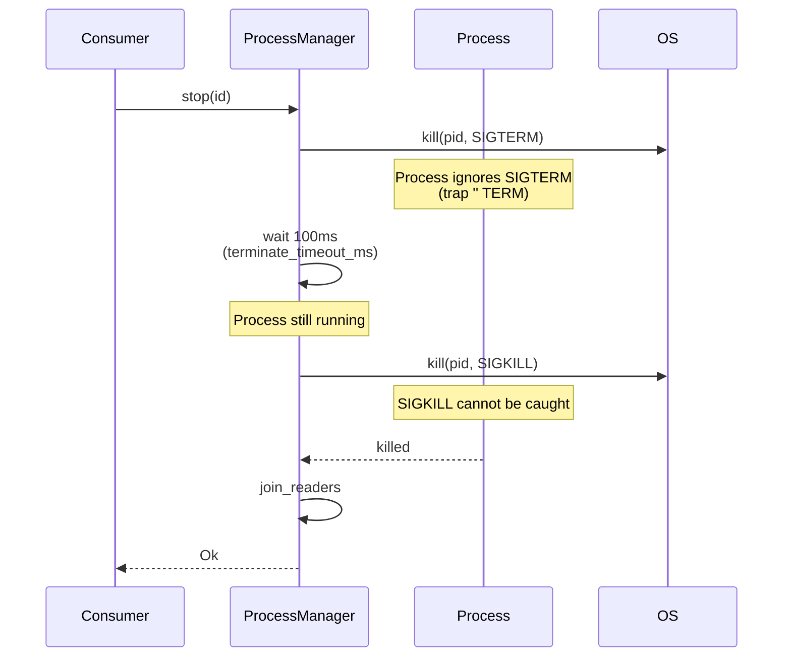

# Stop Escalation

Observe the SIGTERM → SIGKILL escalation path with a short timeout.

## Overview

When `stop()` is called, the manager sends the configured `kill_signal` (default `SIGTERM`), waits up to `terminate_timeout_ms`, and escalates to `SIGKILL` if the process is still running. This example uses a very short timeout (100ms) and a process that ignores `SIGTERM` to demonstrate the escalation.



## Example

```rust
use smearor_wrot_process::{KillSignal, ProcessConfig, ProcessManager, StdioConfig};

fn main() -> Result<(), Box<dyn std::error::Error>> {
    let manager = ProcessManager::new();

    // Process that ignores SIGTERM (trap '' TERM)
    let config = ProcessConfig::builder()
        .command("sh".to_string())
        .args(vec!["-c".to_string(), "trap '' TERM; sleep 30".to_string()])
        .kill_signal(KillSignal::Sigterm)
        .terminate_timeout_ms(100)
        .stdout(StdioConfig::Null)
        .stderr(StdioConfig::Null)
        .build();

    let id = manager.start("stubborn", &config)?;
    println!("Started stubborn process (PID {})", manager.get_pid(id).unwrap());

    // stop() will send SIGTERM, wait 100ms, then escalate to SIGKILL
    manager.stop(id)?;
    println!("Process stopped (escalated to SIGKILL)");
    assert!(manager.is_empty());

    Ok(())
}
```

## Running the Example

```sh
cargo run --example stop_escalation
```
