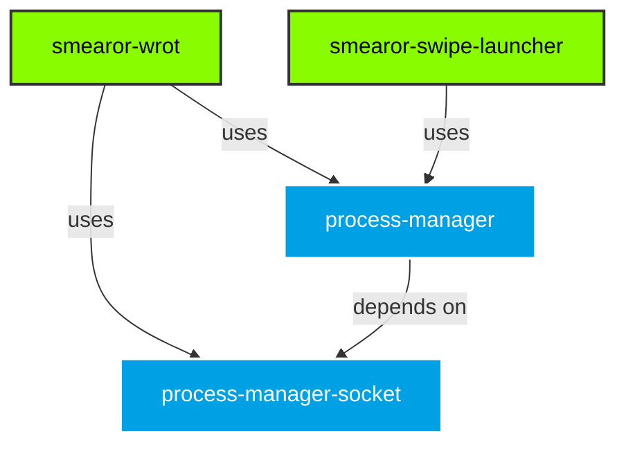

# Introduction

Welcome to the documentation for `smearor-wrot-process-manager`.

This workspace provides shared socket and process management crates for the `smearor-wrot` Wayland compositor and the `smearor-swipe-launcher` desktop launcher.

## Why smearor-wrot-process-manager?

Both `smearor-wrot` and `smearor-swipe-launcher` need to spawn and manage child processes — compositor clients, terminal commands, desktop applications. Previously, each project had its own ad-hoc process tracking:

- **`smearor-wrot`** used a `launch_application()` function that spawned a child, set `WAYLAND_DISPLAY`, and returned a `Child` handle — but had no tracking, no reaper, and no graceful shutdown.
- **`smearor-swipe-launcher`** used a `TrackedProcess` struct with `DashMap`-based tracking, manual `/proc/{pid}` polling for exit detection, and `nix::sys::signal::kill` for termination — duplicated across both `terminal_command` and `app-launcher` services.

This workspace consolidates that logic into two reusable, framework-agnostic crates:

1. **`process-manager-socket`** — Wayland socket path management with `Socket`, `SocketBuilder`, and `SocketManager`
2. **`process-manager`** — Child process lifecycle management with `ProcessConfig`, `ProcessManager`, and an optional reaper thread

## Key Benefits

- **No duplicate code** — Both projects share the same `ProcessManager` instead of maintaining separate tracking logic
- **Zombie prevention** — The reaper thread calls `try_wait()` on all tracked processes, preventing zombies without per-process wait threads
- **Graceful shutdown** — `terminate_on_exit` flag ensures processes are killed when the manager is dropped
- **Signal escalation** — `SIGTERM` with configurable timeout, automatic `SIGKILL` escalation for stubborn processes
- **Label-based grouping** — Start and stop multiple processes under a shared label (e.g. all workers in a pool)
- **Forked/detached support** — `setsid()` via `pre_exec` for processes that should survive parent exit
- **Wayland socket binding** — Automatically sets `WAYLAND_DISPLAY` in child environment
- **Framework-agnostic** — No dependency on GTK, Smithay, or any plugin API

## Crate Relationship

## Consumers

- **`smearor-wrot`** — Uses `SocketManager` for multi-output Wayland sockets and `ProcessManager` for spawning compositor clients.
- **`smearor-swipe-launcher`** — Uses `ProcessManager` in its `terminal_command` and `app-launcher` services for launching and tracking commands and applications.

## Getting Started

Head over to the [Architecture](architecture.md) page for a visual overview of how the crates work internally. For code examples, see [Usage Examples](examples.md). To migrate from the old approach, see the [Migration Guide](migration.md).

## License

MIT
