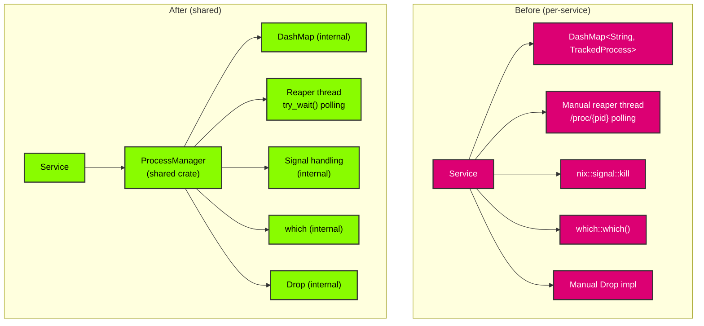

# Migration Guide

This guide covers migrating from the old ad-hoc process management patterns to `ProcessManager`.

## From `launch_application()` (smearor-wrot)

The old `launch_application()` function in `smearor-wrot-application` has been replaced by `ProcessManager::start()`.

### Before

```rust
let child = launch_application(
    &socket,
    &command,
    &args,
    &env,
    working_dir,
    forked,
    terminate_on_exit,
)?;
```

### After

```rust
let config = ProcessConfig::builder()
    .command(command)
    .args(args)
    .env(env)
    .working_dir(working_dir)
    .forked(forked)
    .terminate_on_exit(terminate_on_exit)
    .socket(Some(socket))
    .build();
let id = process_manager.start("client", &config)?;
```

### Key Differences

| Aspect | Old (`launch_application`) | New (`ProcessManager`) |
|--------|---------------------------|------------------------|
| Process tracking | None — returns raw `Child` | `DashMap` with `ProcessId` and labels |
| Executable resolution | Manual `which` calls | Built-in via `which` in `start()` |
| Termination | Manual `child.kill()` | `stop()`, `stop_label()`, or drop |
| Zombie prevention | None | Optional reaper thread |
| Graceful shutdown | Manual `Drop` impl | `terminate_on_exit` flag + `ProcessManager::drop` |
| Signal handling | `Child::kill()` (SIGKILL only) | `SIGTERM` with timeout, `SIGKILL` escalation |
| Wayland socket | Manual `WAYLAND_DISPLAY` set | Automatic via `ProcessConfig::socket()` |

## From `TrackedProcess` (smearor-swipe-launcher)

The `TrackedProcess` struct and manual reaper threads in both `terminal_command` and `app-launcher` services have been replaced by `ProcessManager`.

### Before

```rust
pub struct TrackedProcess {
    pub pid: u32,
    pub terminate_on_exit: bool,
}

// Manual DashMap for tracking
tracked_processes: DashMap<String, TrackedProcess>,

// Manual reaper thread checking /proc/{pid}
fn check_process_status(&self) {
    for entry in self.tracked_processes.iter() {
        let pid = entry.pid;
        if !Path::new(&format!("/proc/{}", pid)).exists() {
            // Process exited
        }
    }
}

// Manual nix::sys::signal::kill for termination
nix::sys::signal::kill(Pid::from_raw(pid), Signal::SIGTERM)?;

// Manual Drop impl iterating tracked_processes
impl Drop for Service {
    fn drop(&mut self) {
        for entry in self.tracked_processes.iter() {
            if entry.terminate_on_exit {
                nix::sys::signal::kill(Pid::from_raw(entry.pid), Signal::SIGTERM)?;
            }
        }
    }
}
```

### After

```rust
pub struct AppLauncherService {
    pub process_manager: Arc<ProcessManager>,
}

// Reaper is built into ProcessManager::with_reaper()
// Termination is ProcessManager::stop_label()
// Drop is handled by ProcessManager::drop()
// No DashMap, no nix, no which in the service
```

### Architecture Comparison



### Key Differences

| Aspect | Old (`TrackedProcess`) | New (`ProcessManager`) |
|--------|------------------------|------------------------|
| Tracking | `DashMap` in each service | `DashMap` in `ProcessManager` (shared) |
| Exit detection | `/proc/{pid}` polling | `try_wait()` polling (portable) |
| Signal handling | `nix` in each service | `nix` in `ProcessManager` only |
| Executable resolution | `which` in each service | `which` in `ProcessManager` only |
| Drop/cleanup | Manual `Drop` impl per service | `ProcessManager::drop` handles all |
| Dependencies per service | `dashmap`, `nix`, `which` | `process-manager` only |
| Code duplication | Duplicated across services | Single shared crate |

### GTK Integration Pattern

The old pattern used blocking `recv()` in `MainContext::spawn_local`, which froze the GTK main loop. The new pattern uses a forwarding thread:

```mermaid
graph LR
    classDef default fill: #1e1e1e, stroke: #333333, stroke-width: 1px, color: #ffffff
    classDef reaper fill: #dc0073, stroke: #333333, stroke-width: 2px, color: #ffffff
    classDef thread fill: #00a1e4, stroke: #ffffff, stroke-width: 2px, color: #ffffff
    classDef gtk fill: #89fc00, stroke: #333333, stroke-width: 2px, color: #000

    A["Reaper Thread"] -->|ProcessExitEvent| B["std::sync::mpsc"]
    B --> C["Forwarding Thread<br/>std::thread::spawn"]
    C -->|unbounded_channel| D["tokio::sync::mpsc"]
    D --> E["MainContext::spawn_local<br/>(non-blocking)"]

    class A reaper
    class B thread
    class C thread
    class D gtk
    class E gtk
```



This ensures the GTK main loop never blocks on `recv()`.
