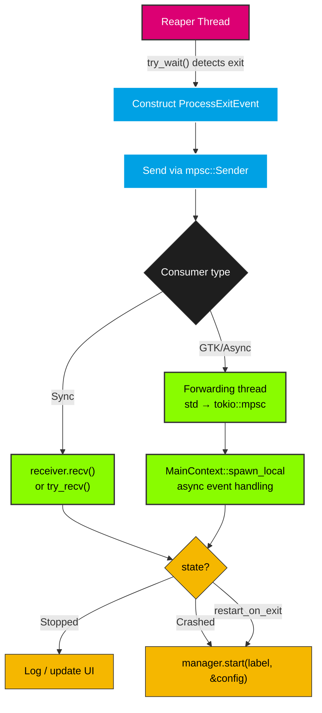

# ProcessExitEvent

`ProcessExitEvent` is emitted by the reaper thread when a tracked process exits.

## Overview

When the reaper thread detects that a process has exited (via `try_wait()`), it constructs a `ProcessExitEvent` and sends it through the `std::sync::mpsc::Sender` provided to `ProcessManager::with_reaper()`.

The consumer receives this event and can decide what to do — log the exit, restart the process, update UI state, etc.

## Fields

| Field | Type | Description |
|-------|------|-------------|
| `id` | `ProcessId` | The unique identifier of the exited process |
| `pid` | `u32` | The OS process ID (for logging/debugging) |
| `label` | `String` | The label under which the process was started |
| `restart_on_exit` | `bool` | Whether the consumer should restart this process |
| `exit_status` | `Option<ExitStatus>` | The exit status of the process (`None` if the child handle was missing or `try_wait()` returned an error) |
| `state` | `ProcessState` | The lifecycle state at exit — `Stopped` if normal exit, `Crashed` if non-zero exit code or signal |

The `restart_on_exit` flag is set from `ProcessConfig::restart_on_exit`. It is a hint — the consumer is free to ignore it. The reaper itself does not restart processes; that is the consumer's responsibility.

## Event Flow



## Consumer Patterns

### 1. Synchronous Consumer

For non-UI applications, the consumer simply calls `receiver.recv()` or `receiver.try_recv()`:

```rust
let (sender, receiver) = std::sync::mpsc::channel();
let manager = ProcessManager::with_reaper(Duration::from_secs(2), sender)?;

manager.start("task", &config)?;

loop {
    let event = receiver.recv()?;
    println!("Process {} (PID {}) exited: {}", event.label, event.pid, event.state);
    
    if event.restart_on_exit || event.state == ProcessState::Crashed {
        manager.start(&event.label, &config)?;
    }
}
```

### 2. GTK Consumer (Forwarding Thread)

**Important:** Do not call `receiver.recv()` directly in `MainContext::spawn_local` — it is a blocking call that will freeze the GTK main loop.

Instead, use a forwarding thread to bridge the blocking `std::sync::mpsc` to a non-blocking `tokio::sync::mpsc` channel:

```rust
use std::sync::mpsc;
use tokio::sync::mpsc::unbounded_channel;
use gtk4::glib::MainContext;

let (sync_sender, sync_receiver) = mpsc::channel();
let (async_sender, mut async_receiver) = unbounded_channel();

// Forwarding thread: bridges blocking recv() to async channel
std::thread::spawn(move || {
    while let Ok(event) = sync_receiver.recv() {
        if async_sender.send(event).is_err() {
            break; // Async receiver dropped — exit thread
        }
    }
});

let manager = ProcessManager::with_reaper(Duration::from_secs(2), sync_sender);
manager.start("task", &config)?;

// In GTK main context — non-blocking
let main_context = MainContext::default();
main_context.spawn_local(async move {
    while let Some(event) = async_receiver.recv().await {
        println!("Process {} exited: {}", event.label, event.state);
        if event.restart_on_exit || event.state == ProcessState::Crashed {
            manager.start(&event.label, &config);
        }
    }
});
```

### 3. Periodic Polling (No Async)

For simple applications that already have a periodic timer:

```rust
loop {
    // Process exit events
    while let Ok(event) = receiver.try_recv() {
        println!("Process {} exited: {}", event.label, event.state);
        if event.restart_on_exit || event.state == ProcessState::Crashed {
            manager.start(&event.label, &config)?;
        }
    }
    
    // Do other work...
    std::thread::sleep(Duration::from_millis(100));
}
```

## Graceful Shutdown

The forwarding thread terminates automatically when:

1. The `ProcessManager` is dropped → the reaper thread stops → the `mpsc::Sender` is dropped
2. `receiver.recv()` returns `Err` (sender disconnected) → the forwarding thread exits
3. The `async_sender` is dropped (when the GTK `MainContext` task completes) → `async_sender.send()` returns `Err` → the forwarding thread exits

This ensures the forwarding thread does not interfere with graceful shutdown. No explicit join is needed.
