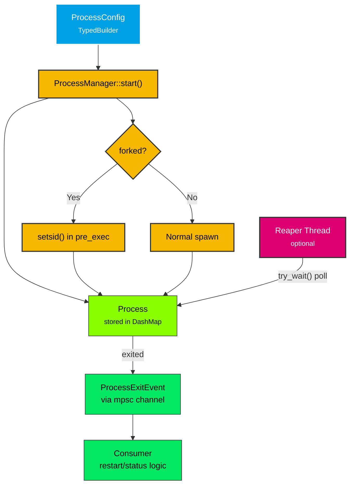

# process-manager

Child process lifecycle management with Wayland socket binding.

## Overview

Provides a `ProcessManager` for spawning, tracking, and terminating child processes. Supports label-based grouping, forked/detached processes, and an optional reaper thread for zombie prevention and exit notifications.

This crate is used by both `smearor-wrot` (to spawn compositor clients like panels, wallpapers, and widgets) and `smearor-swipe-launcher` (to launch terminal commands and desktop applications). It replaces the ad-hoc `launch_application()` function in wrot and the duplicated `TrackedProcess` struct in swipe-launcher.

## Types

- **`ProcessConfig`** - Unified configuration via `TypedBuilder` (command, args, env, working_dir, shell, forked, terminate_on_exit, kill_signal, restart_on_exit, stdio, socket)
- **`ProcessManager`** - Concurrent process tracking via `DashMap`, label-based grouping, optional reaper thread
- **`Process`** / **`ProcessId`** / **`ProcessInfo`** - Process handle, unique identifier, and lightweight snapshot type
- **`ProcessState`** - Explicit lifecycle state enum (`Starting`, `Running`, `Stopping`, `Stopped`, `Crashed`, `Restarting`, `Failed`)
- **`ProcessExitEvent`** - Reaper exit notification with `id`, `pid`, `label`, `restart_on_exit`, `exit_status`, `state`
- **`StdioConfig`** - Inherit/Null/Piped enum for standard streams
- **`KillSignal`** - Sigterm/Sigkill enum for termination config
- **`Signal`** - Broader signal enum (SIGHUP, SIGUSR1, SIGSTOP, etc.) for general process control
- **`ProcessManagerError`** / **`ProcessConfigError`** - Error types

## Architecture

## Features

- **`ProcessConfig` with `TypedBuilder`** - Compile-time enforcement of required fields, ergonomic optional fields
- **Label-based grouping** - Start/stop multiple processes under a shared label
- **Forked/detached processes** - `setsid()` via `pre_exec` for terminal detachment
- **Reaper thread** - Non-blocking `try_wait()` polling with `ProcessExitEvent` channel
- **Signal escalation** - `SIGTERM` with configurable timeout, automatic `SIGKILL` escalation
- **Wayland socket binding** - Sets `WAYLAND_DISPLAY` from `Socket`
- **`StdioConfig`** - Inherit/Null/Piped with reader threads for output capture
- **`KillSignal`** - `Sigterm`/`Sigkill` with serde support for termination config
- **`Signal`** - Broader signal enum for general process control via `send_signal()`
- **Restart** - `restart()` / `restart_label()` preserve config and label across restarts
- **Serde** - `ProcessConfig`, `StdioConfig`, `KillSignal`, and `Signal` implement `Serialize`/`Deserialize`
- **Executable resolution** - `which` integration for PATH lookup
- **Graceful shutdown** - `terminate_on_exit` flag kills processes on drop
- **`#[must_use]`** - All public structs and enums are `#[must_use]`

## Dependencies

| Crate | Purpose |
|-------|---------|
| `dashmap` | Concurrent process tracking |
| `nix` | Signal handling (`SIGTERM`, `SIGKILL`) |
| `libc` | `setsid()` for forked processes |
| `typed-builder` | `ProcessConfig` builder pattern |
| `which` | Executable path resolution |
| `process-manager-socket` | Wayland socket binding |
| `thiserror` | Error types |
| `tracing` | Logging |

See the individual pages for detailed documentation:
- [ProcessConfig](config.md)
- [ProcessManager](manager.md)
- [Process & ProcessId](process.md)
- [ProcessState](state.md)
- [StdioConfig](stdio_config.md)
- [Signal](signal.md)
- [Reaper Thread](reaper.md)
- [ProcessExitEvent](exit_event.md)
- [Error Types](errors.md)
