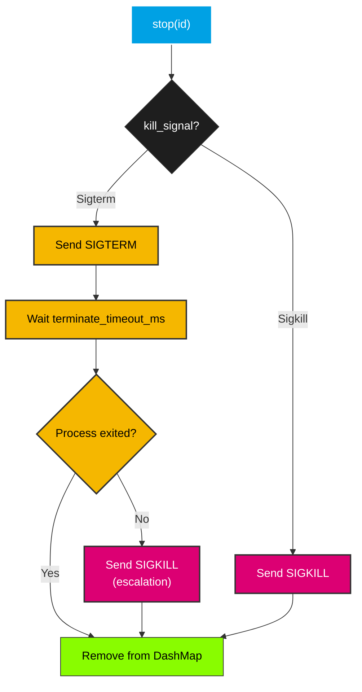

# KillSignal

`KillSignal` specifies which signal to send when terminating a process.

## Variants

| Variant | Signal | Description |
|---------|--------|-------------|
| `Sigterm` | `SIGTERM` (15) | Graceful termination — the process can catch and handle it |
| `Sigkill` | `SIGKILL` (9) | Immediate termination — cannot be caught or handled |

## Serde

`KillSignal` implements `Serialize` and `Deserialize` with `#[serde(rename_all = "UPPERCASE")]`, so it serializes as `"SIGTERM"` and `"SIGKILL"`. This makes it suitable for JSON/TOML configuration files.

## Escalation Flow

When `ProcessManager::stop()` is called, the `kill_signal` determines the termination behavior:



## Usage in Config

```rust
use smearor_wrot_process::{KillSignal, ProcessConfig};

// Graceful termination with 3 second timeout
let config = ProcessConfig::builder()
    .command("my-app".to_string())
    .kill_signal(KillSignal::Sigterm)
    .terminate_timeout_ms(3000)
    .build();

// Immediate kill (no grace period)
let config = ProcessConfig::builder()
    .command("stubborn-app".to_string())
    .kill_signal(KillSignal::Sigkill)
    .build();
```

## When to Use Which

- **`Sigterm`** (default) — Use for well-behaved processes that clean up on `SIGTERM` (save state, close connections, flush buffers). The configurable timeout gives them time to shut down gracefully.
- **`Sigkill`** — Use for processes that don't respond to `SIGTERM` or when you need immediate termination. `SIGKILL` cannot be caught, so the process is killed instantly by the kernel.

## Why Not `Child::kill()`?

`std::process::Child::kill()` always sends `SIGKILL`. There is no way to send `SIGTERM` using the standard library alone. The `nix` crate provides `nix::sys::signal::kill(pid, signal)` which allows sending any signal, including `SIGTERM`. This is why `smearor-wrot-process` depends on `nix`.
