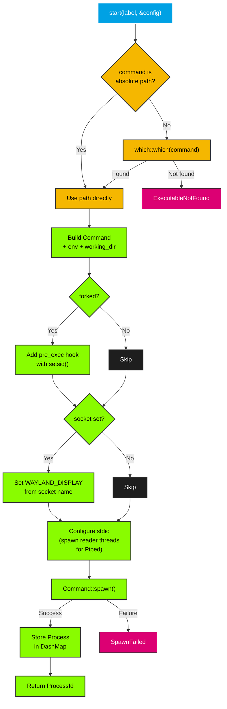

# ProcessManager

`ProcessManager` manages child processes concurrently using `DashMap`.

## Overview

`ProcessManager` is the central component of the `smearor-wrot-process` crate. It provides:

- **Concurrent tracking** — All processes are stored in a `DashMap` keyed by `ProcessId`, allowing concurrent access from multiple threads
- **Label-based grouping** — Multiple processes can share a label for grouped start/stop operations
- **Optional reaper thread** — A background thread that polls `try_wait()` to detect exits and emit `ProcessExitEvent`s
- **Signal-based termination** — `SIGTERM` with configurable timeout, automatic `SIGKILL` escalation
- **Graceful shutdown** — Processes with `terminate_on_exit = true` are killed when the manager is dropped

## Construction

### `new()` — Without reaper

```rust
use smearor_wrot_process::ProcessManager;

let manager = ProcessManager::new();
```

Use this when you don't need exit notifications. Processes are still tracked and can be stopped manually. Without the reaper, exited processes remain as zombies until `stop()` or `drop()` is called.

### `with_reaper(poll_interval, sender)` — With reaper

```rust
use smearor_wrot_process::ProcessManager;
use std::time::Duration;

let (sender, receiver) = std::sync::mpsc::channel();
let manager = ProcessManager::with_reaper(Duration::from_secs(2), sender);
```

The reaper thread polls all tracked processes every `poll_interval` and emits `ProcessExitEvent`s via the `sender`. This prevents zombies and enables exit notifications and restart logic.

## Methods

### Spawning

| Method | Returns | Description |
|--------|---------|-------------|
| `start(label, &config)` | `Result<ProcessId, ProcessManagerError>` | Spawn a child process with the given label and config |

`start()` performs the following:
1. Resolves the executable via `which` if not an absolute path
2. Constructs `std::process::Command` with env, working_dir, shell mode
3. Applies `setsid()` via `pre_exec` if `config.forked` is `true`
4. Sets `WAYLAND_DISPLAY` if `config.socket` is `Some`
5. Configures stdio (spawns reader threads for `Piped`)
6. Spawns the child and stores it in the `DashMap`

### Stopping

| Method | Returns | Description |
|--------|---------|-------------|
| `stop(id)` | `Result<(), ProcessManagerError>` | Stop a single process by `ProcessId` |
| `stop_label(label)` | `Result<(), ProcessManagerError>` | Stop all processes under a label |
| `stop_all()` | `()` | Stop all tracked processes |

`stop()` sends the configured `kill_signal`, waits up to `terminate_timeout_ms`, and escalates to `SIGKILL` if the process is still running.

### Querying

| Method | Returns | Description |
|--------|---------|-------------|
| `get(id)` | `Option<Process>` | Get a process by `ProcessId` (returns `DashMap` guard) |
| `get_by_label(label)` | `Vec<Process>` | Get all processes with a label |
| `pids_by_label(label)` | `Vec<u32>` | Get PIDs for a label |
| `labels()` | `Vec<String>` | List all distinct labels |
| `ids()` | `Vec<ProcessId>` | List all `ProcessId`s |
| `is_empty()` | `bool` | Check if manager has no processes |
| `len()` | `usize` | Number of tracked processes |

## Start Flow



## Drop Behavior

When `ProcessManager` is dropped:

1. If the reaper thread is active, it is stopped (via `stop_flag` atomic) and joined
2. All processes with `terminate_on_exit = true` are terminated (SIGTERM → wait → SIGKILL)
3. Processes with `terminate_on_exit = false` are left running (detached)
4. The `DashMap` is dropped, freeing all resources

## Usage

### Without reaper

```rust
use smearor_wrot_process::{ProcessConfig, ProcessManager, StdioConfig};

let manager = ProcessManager::new();
let config = ProcessConfig::builder()
    .command("sleep".to_string())
    .args(vec!["10".to_string()])
    .stdout(StdioConfig::Null)
    .stderr(StdioConfig::Null)
    .build();

let id = manager.start("task", &config)?;
// ... do work ...
manager.stop(id)?;
```

### With reaper and restart

```rust
use smearor_wrot_process::{ProcessConfig, ProcessManager, StdioConfig};
use std::time::Duration;

let (sender, receiver) = std::sync::mpsc::channel();
let manager = ProcessManager::with_reaper(Duration::from_secs(2), sender);

let config = ProcessConfig::builder()
    .command("my-service".to_string())
    .restart_on_exit(true)
    .stdout(StdioConfig::Null)
    .build();

manager.start("service", &config)?;

// In your event loop:
if let Ok(event) = receiver.try_recv() {
    if event.restart_on_exit {
        manager.start(&event.label, &config)?;
    }
}
```

### Label-based operations

```rust
let config = ProcessConfig::builder()
    .command("worker".to_string())
    .stdout(StdioConfig::Null)
    .build();

// Start a pool of workers
for _ in 0..4 {
    manager.start("worker-pool", &config)?;
}

// Check all PIDs
let pids = manager.pids_by_label("worker-pool");
assert_eq!(pids.len(), 4);

// Stop the entire pool
manager.stop_label("worker-pool")?;
assert!(manager.is_empty());
```
