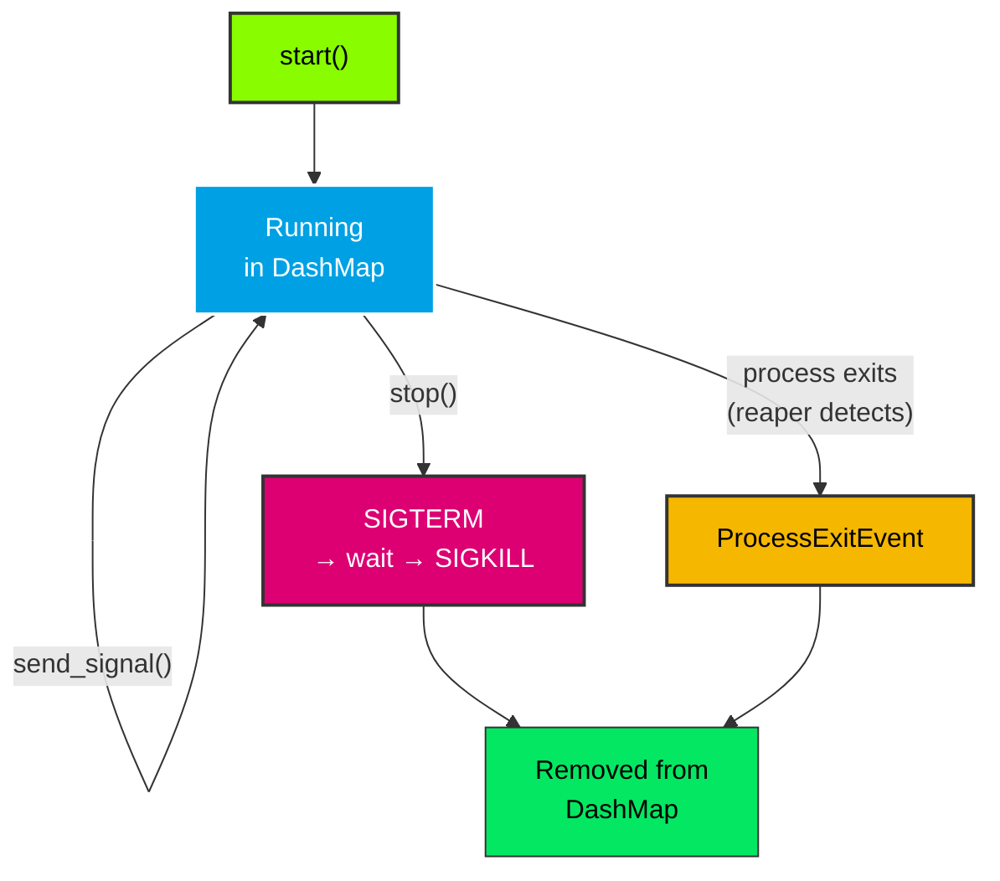

# Process & ProcessId

## ProcessId

A unique identifier assigned by `ProcessManager` to each spawned process. Implemented as a `u64` newtype.

`ProcessId` is generated atomically from an internal counter in `ProcessManager`. It is unique within a single `ProcessManager` instance — no two processes will share the same `ProcessId`.

### Trait Implementations

- `Display` — formats as a number
- `PartialEq`, `Eq`, `Hash` — comparison and hashing
- `Clone`, `Copy` — lightweight value type

### Usage

```rust
// ProcessId is returned by start()
let id = manager.start("task", &config)?;

// Used for stop(), get(), etc.
manager.stop(id)?;
let process = manager.get(id);
```

## Process

A handle to a managed child process. Stored in `ProcessManager`'s `DashMap` and accessed via `get_info()` which returns a `ProcessInfo` snapshot.

### Lifecycle



### Fields

| Field | Type | Description |
|-------|------|-------------|
| `id` | `ProcessId` | Unique identifier assigned by `ProcessManager` |
| `pid` | `u32` | OS process ID |
| `program_name` | `String` | Program name (for error reporting) |
| `label` | `String` | Label under which the process was started |
| `terminate_on_exit` | `bool` | Whether to terminate on `ProcessManager` drop |
| `config` | `ProcessConfig` | The configuration this process was started with |
| `child` | `Option<Child>` | The `std::process::Child` handle (always `Some`) |

### Methods

| Method | Returns | Description |
|--------|---------|-------------|
| `is_running()` | `bool` | Non-blocking check via `try_wait()` — `true` if still running |
| `send_signal(signal)` | `Result<(), nix::Error>` | Send a signal to the process via `nix::sys::signal::kill` |
| `force_kill()` | `Result<(), nix::Error>` | Send `SIGKILL` immediately |

### Clone Behavior

`Process` implements `Clone` manually because `std::process::Child` does not implement `Clone`. The clone shares the PID and config but does not duplicate the `Child` handle — the clone's `child` field is `None`. This is sufficient for read-only access patterns (checking `is_running()`, reading PID/label).

### Usage

```rust
let id = manager.start("task", &config)?;

// Access via DashMap guard
let process = manager.get(id).unwrap();
println!("PID: {}, Label: {}", process.pid, process.label);
println!("Running: {}", process.is_running());
drop(process); // Release DashMap guard

// Stop the process
manager.stop(id)?;
```
