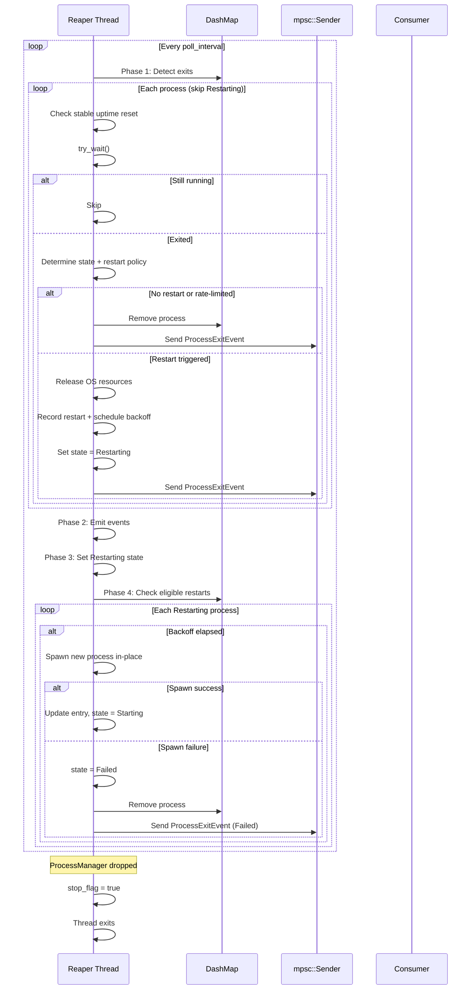

# Reaper Thread

The reaper thread is an optional background thread that polls `try_wait()` on all tracked processes at a configurable interval, preventing zombies and emitting `ProcessExitEvent`s.

## Overview

When a child process exits, it becomes a zombie until someone calls `wait()` or `try_wait()` on it. Without the reaper, the consumer must manually call `is_running()` or `stop()` to reap exited processes. The reaper thread automates this:

1. Spawns a `std::thread` named `"process-reaper"`
2. Every `poll_interval`, iterates all tracked processes in the `DashMap`
3. For each process: checks stable uptime reset, then calls `try_wait()` to detect exits
4. If a process has exited: determines `ProcessState` (`Stopped` or `Crashed`), checks restart policy and rate limiting, emits `ProcessExitEvent`, and either removes the process or transitions it to `Restarting`
5. For processes in `Restarting` state: checks if backoff timer has elapsed, and if so, spawns a new process in-place (preserving `ProcessId`)
6. Runs until `ProcessManager` is dropped (via a `stop_flag` `AtomicBool`)

## Polling Cycle



## Polling vs. `pidfd`

The reaper uses polling (`try_wait()`) rather than `pidfd_open` (Linux ≥ 5.3). This means:

- **Exit detection latency** - Up to `poll_interval` delay between process exit and event emission. With the default 2-second interval, a process exit is detected within 2 seconds.
- **CPU usage** - The thread wakes up every `poll_interval` and iterates all processes. For a small number of processes (< 100), this is negligible.
- **Portability** - `try_wait()` works on all Unix systems. `pidfd_open` is Linux-only.

A future improvement could use `pidfd_open` for instant notification, but the current approach is sufficient for the use case (compositor clients and launcher apps).

## Zombie Prevention

Without the reaper, exited child processes remain as zombies until someone calls `wait()`. Zombies consume a PID and a small amount of kernel memory. In long-running applications (like a Wayland compositor or desktop launcher), zombies accumulate over time.

The reaper calls `try_wait()` which reaps the zombie immediately upon detection. Even without the reaper, `ProcessManager::drop` will clean up remaining processes - but the reaper is recommended for long-lived managers.

## Thread Safety

The reaper thread accesses the `DashMap` via an `Arc`, so it works concurrently with `start()`, `stop()`, and other operations from the main thread. `DashMap`'s shard-level locking ensures no contention:

- The reaper iterates with `DashMap::iter()` which takes a snapshot of shard read locks
- `start()` inserts into a shard - may briefly block the reaper on that shard
- `stop()` removes from a shard - may briefly block the reaper on that shard

This is acceptable for the use case (low-frequency operations, small number of processes).

## Usage

```rust
use process_manager::{ProcessConfig, ProcessManager, StdioConfig};
use std::time::Duration;

let (sender, receiver) = std::sync::mpsc::channel();
let manager = ProcessManager::with_reaper(Duration::from_secs(2), sender)?;

let config = ProcessConfig::builder()
    .command("true".to_string())
    .stdout(StdioConfig::Null)
    .build();

manager.start("task", &config)?;

// Receive exit event
let event = receiver.recv_timeout(Duration::from_secs(10))?;
println!("Process {} (PID {}) exited: {}", event.label, event.pid, event.state);
```
