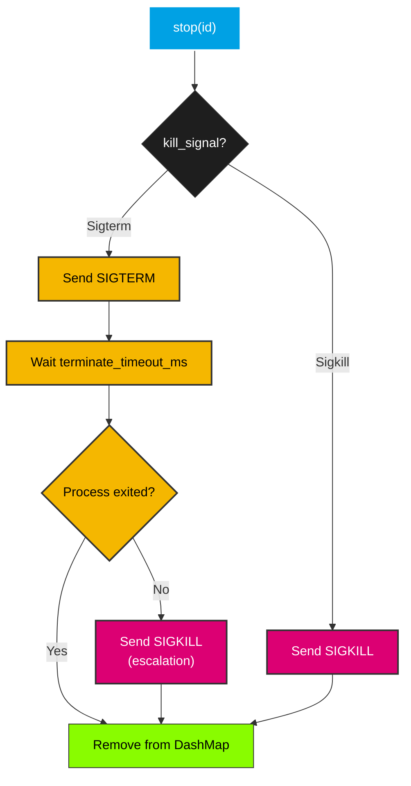
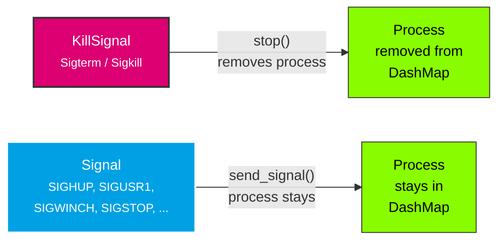

# Signal

The `signal` module provides two signal enums for different use cases:

- **[`KillSignal`]** — Restricted to `SIGTERM`/`SIGKILL`, used for process termination via `stop()`
- **[`Signal`]** — Broader enum for general-purpose signaling via `send_signal()`

## KillSignal

`KillSignal` specifies which signal to send when terminating a process. It is intentionally limited to the two signals that make sense for the `stop()` path.

### Variants

| Variant | Signal | Description |
|---------|--------|-------------|
| `Sigterm` | `SIGTERM` (15) | Graceful termination — the process can catch and handle it |
| `Sigkill` | `SIGKILL` (9) | Immediate termination — cannot be caught or handled |

### Serde

`KillSignal` implements `Serialize` and `Deserialize` with `#[serde(rename_all = "UPPERCASE")]`, so it serializes as `"SIGTERM"` and `"SIGKILL"`. This makes it suitable for JSON/TOML configuration files.

### Escalation Flow

When `ProcessManager::stop()` is called, the `kill_signal` determines the termination behavior:



### Usage in Config

```rust
use smearor_wrot_process::{KillSignal, ProcessConfig};

// Graceful termination with 3 second timeout
let config = ProcessConfig::builder()
    .command("my-app".to_string())
    .kill_signal(KillSignal::Sigterm)
    .terminate_timeout_ms(3000)
    .build();

// Immediate kill (no grace period)
let config = ProcessConfig::builder()
    .command("stubborn-app".to_string())
    .kill_signal(KillSignal::Sigkill)
    .build();
```

### When to Use Which

- **`Sigterm`** (default) — Use for well-behaved processes that clean up on `SIGTERM` (save state, close connections, flush buffers). The configurable timeout gives them time to shut down gracefully.
- **`Sigkill`** — Use for processes that don't respond to `SIGTERM` or when you need immediate termination. `SIGKILL` cannot be caught, so the process is killed instantly by the kernel.

## Signal

`Signal` is a broader enum covering common Unix signals for general process control. It is used with `ProcessManager::send_signal()` and `send_signal_label()`, which send a signal without removing the process from the manager.

### Variants

| Variant | Signal | Description |
|---------|--------|-------------|
| `Sighup` | `SIGHUP` (1) | Hang up — often used to reload configuration |
| `Sigint` | `SIGINT` (2) | Interrupt (Ctrl+C) |
| `Sigquit` | `SIGQUIT` (3) | Quit with core dump |
| `Sigterm` | `SIGTERM` (15) | Graceful termination request |
| `Sigkill` | `SIGKILL` (9) | Immediate forced termination, cannot be caught |
| `Sigusr1` | `SIGUSR1` (10) | User-defined signal 1 |
| `Sigusr2` | `SIGUSR2` (12) | User-defined signal 2 |
| `Sigwinch` | `SIGWINCH` (28) | Window size change |
| `Sigstop` | `SIGSTOP` (19) | Pause execution, cannot be caught |
| `Sigcont` | `SIGCONT` (18) | Resume execution after `SIGSTOP` |
| `Sigalrm` | `SIGALRM` (14) | Timer alarm |

### Serde

`Signal` implements `Serialize` and `Deserialize` with `#[serde(rename_all = "UPPERCASE")]`, so it serializes as e.g. `"SIGUSR1"`, `"SIGHUP"`, etc.

### Conversion from KillSignal

`Signal` implements `From<KillSignal>`, so a `KillSignal` can be converted to a `Signal` when needed:

```rust
use smearor_wrot_process::{KillSignal, Signal};

let signal: Signal = KillSignal::Sigterm.into();
assert_eq!(signal, Signal::Sigterm);
```

### Usage with send_signal

```rust
use smearor_wrot_process::{ProcessConfig, ProcessManager, Signal, StdioConfig};

let manager = ProcessManager::new();
let config = ProcessConfig::builder()
    .command("my-app".to_string())
    .stdout(StdioConfig::Null)
    .stderr(StdioConfig::Null)
    .build();

let id = manager.start("worker", &config)?;

// Send SIGHUP to trigger a config reload
manager.send_signal(id, Signal::Sighup)?;

// Send SIGUSR1 to all processes with label "worker"
manager.send_signal_label("worker", Signal::Sigusr1)?;

// Stop the process (uses configured kill_signal)
manager.stop(id)?;
```

### KillSignal vs Signal

| Aspect | `KillSignal` | `Signal` |
|--------|-------------|----------|
| Variants | `Sigterm`, `Sigkill` | 11 common Unix signals |
| Used by | `ProcessConfig::kill_signal`, `stop()` | `send_signal()`, `send_signal_label()` |
| Purpose | Termination with escalation | General process control |
| Removes process | Yes (via `stop()`) | No — process stays in manager |



## Why Not `Child::kill()`?

`std::process::Child::kill()` always sends `SIGKILL`. There is no way to send `SIGTERM` using the standard library alone. The `nix` crate provides `nix::sys::signal::kill(pid, signal)` which allows sending any signal, including `SIGTERM`. This is why `smearor-wrot-process` depends on `nix`.
