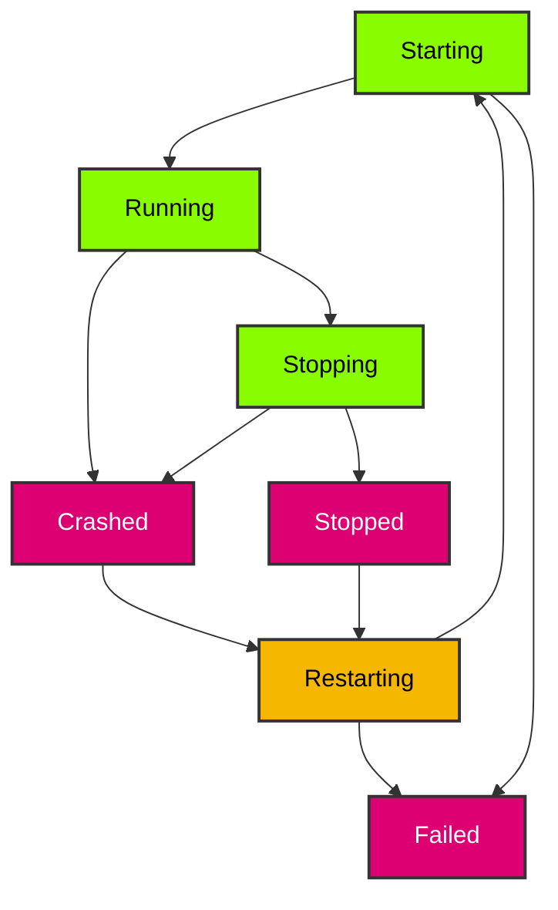

# ProcessState

`ProcessState` is an explicit lifecycle state enum that replaces the binary `is_running() -> bool` check with a granular state machine.

## Overview

Each managed process has a `ProcessState` that reflects its current lifecycle phase. The state is updated lazily by `state()` / `is_running()` via non-blocking `try_wait()`, and explicitly by `stop()`, `restart()`, and the reaper thread.

## Variants

| Variant | Description |
|---------|-------------|
| `Starting` | The process is being spawned and has not yet been confirmed running. Transient state between `spawn()` and insertion into the manager. |
| `Running` | The process is alive and running. Confirmed via `try_wait()` returning `Ok(None)`. |
| `Stopping` | A stop signal has been sent and the manager is waiting for exit. Set by `stop()` / `stop_many()`. |
| `Stopped` | The process has exited normally (exit code 0 or stopped by the manager within the grace period). |
| `Crashed` | The process exited unexpectedly with a non-zero exit code or signal. |
| `Restarting` | A restart is in progress - the process is in backoff wait. The OS child handle is `None` (resources released). `send_signal()` returns an error; `stop()` cancels backoff silently; `restart()` spawns immediately. |
| `Failed` | The process failed to start, could not be killed, or exhausted restarts (rate limit exceeded or spawn failure during automatic restart). |

## State Transitions



## Helper Methods

| Method | Returns | Description |
|--------|---------|-------------|
| `is_alive()` | `bool` | `true` for `Starting`, `Running`, `Stopping`, `Restarting` - equivalent to the old `is_running()` semantics |
| `is_terminated()` | `bool` | `true` for `Stopped`, `Crashed`, `Failed` |

## Trait Implementations

- `Debug`, `Clone`, `Copy`, `PartialEq`, `Eq`, `Hash`
- `Default` - defaults to `Starting`
- `Display` - lowercase string (`"starting"`, `"running"`, etc.)

## Usage

```rust
use process_manager::{ProcessConfig, ProcessManager, ProcessState, StdioConfig};

let manager = ProcessManager::new();
let config = ProcessConfig::builder()
    .command("sleep".to_string())
    .args(vec!["10".to_string()])
    .stdout(StdioConfig::Null)
    .stderr(StdioConfig::Null)
    .build();

let id = manager.start("task", &config)?;

// Check the explicit state
match manager.state(id) {
    Some(ProcessState::Running) => println!("Process is running"),
    Some(ProcessState::Stopped) => println!("Process stopped normally"),
    Some(ProcessState::Crashed) => println!("Process crashed!"),
    Some(state) => println!("Process state: {}", state),
    None => println!("Process not found"),
}

// is_running() still works (delegates to state().is_alive())
assert_eq!(manager.is_running(id), Some(true));

// ProcessInfo also includes the state
let info = manager.get_info(id).unwrap();
println!("State: {}", info.state);
```

## In ProcessExitEvent

When the reaper thread detects an exit, it sets the `state` field on `ProcessExitEvent`:

```rust
let event = receiver.recv_timeout(Duration::from_secs(5))?;
match event.state {
    ProcessState::Stopped => println!("Process {} exited normally", event.label),
    ProcessState::Crashed => println!("Process {} crashed", event.label),
    ProcessState::Failed => println!("Process {} failed (rate limit or spawn error)", event.label),
    _ => unreachable!(),
}
```
