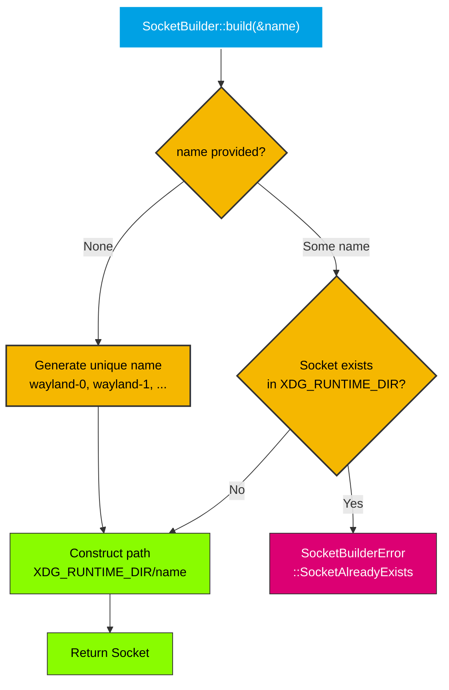

# SocketBuilder

`SocketBuilder` constructs socket paths in `XDG_RUNTIME_DIR`.

## Behavior

`SocketBuilder::build()` takes an optional name and returns a `Socket`:

- If a name is provided (`Some("wayland-0")`), it validates that no socket file with that name already exists in `XDG_RUNTIME_DIR`.
- If no name is provided (`None`), it generates a unique name by incrementing a counter (`wayland-0`, `wayland-1`, `wayland-2`, ...) until an unused name is found.
- The socket path is constructed as `XDG_RUNTIME_DIR/{name}`.

## Build Flow



## Usage

```rust
use process_manager_socket::SocketBuilder;

// Auto-generate unique name (recommended)
let socket = SocketBuilder::build(&None)?;
// e.g. /run/user/1000/wayland-0

// Use a specific name
let socket = SocketBuilder::build(&Some("wayland-1".to_string()))?;
// /run/user/1000/wayland-1
```

## Errors

| Error | When |
|-------|------|
| `SocketBuilderError::XdgRuntimeDirNotSet` | `XDG_RUNTIME_DIR` environment variable is not set |
| `SocketBuilderError::SocketAlreadyExists` | A socket file with the given name already exists in `XDG_RUNTIME_DIR` |
