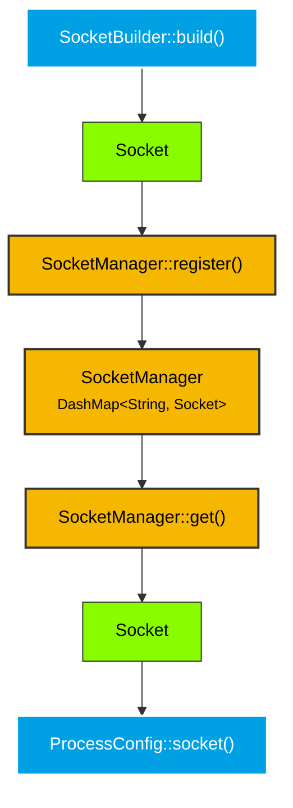

# smearor-wrot-socket

Wayland socket path management crate.

## Overview

Provides types for building, registering, and managing Wayland socket paths. Sockets are created in `XDG_RUNTIME_DIR` and can be shared across threads via `Arc<SocketManager>`.

In a Wayland compositor, each output may need its own socket. `SocketManager` allows registering multiple sockets by name (e.g. `"default"`, `"hdmi-1"`) and retrieving them when spawning compositor clients. The `Socket` type is a lightweight `PathBuf` newtype that can be passed to `ProcessConfig::socket()` to automatically set `WAYLAND_DISPLAY` in a child process's environment.

## Types

- **`Socket`** — `PathBuf` newtype with `Deref<Target = Path>`, `Display`, `AsRef<OsStr>`, `AsRef<str>` implementations
- **`SocketBuilder`** — Builds socket paths in `XDG_RUNTIME_DIR`, validates existing names or generates unique ones
- **`SocketManager`** — Multi-socket manager using `DashMap`, shareable via `Arc` across threads
- **`SocketBuilderError`** — Error type for socket construction failures
- **`SocketManagerError`** — Error type for socket management operations

## Architecture



## Dependencies

- `dashmap` — concurrent map for `SocketManager`
- `thiserror` — error types

## Usage

```rust
use smearor_wrot_socket::{SocketBuilder, SocketManager};
use std::sync::Arc;

// Build a socket (auto-generates unique name if None)
let socket = SocketBuilder::build(&None)?;

// Register in manager
let manager = Arc::new(SocketManager::new());
manager.register("default", socket)?;

// Retrieve by name
let socket = manager.get("default");
assert!(socket.is_some());
```

See the individual pages for detailed documentation:
- [Socket Type](socket_type.md)
- [SocketBuilder](builder.md)
- [SocketManager](manager.md)
- [Error Types](errors.md)
