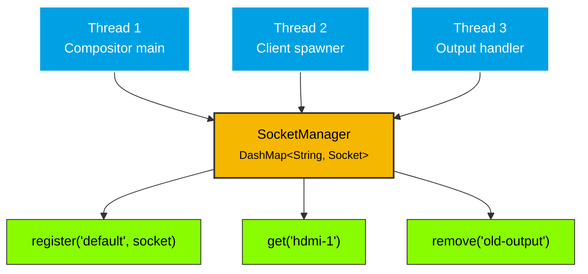

# SocketManager

`SocketManager` manages multiple Wayland sockets concurrently using `DashMap`.

## Overview

In a multi-output Wayland compositor, each output may have its own socket. `SocketManager` provides a concurrent registry for named sockets, allowing the compositor to:

- Register sockets by name (`"default"`, `"hdmi-1"`, etc.)
- Retrieve sockets when spawning compositor clients
- Share socket references across threads via `Arc`

The `DashMap` backend allows concurrent reads and writes without a single `Mutex` lock — multiple threads can register and retrieve sockets simultaneously.

`register()` uses the `DashMap` entry API for atomic check-and-insert, preventing TOCTOU race conditions when multiple threads register sockets concurrently.

## API

| Method | Returns | Description |
|--------|---------|-------------|
| `new()` | `SocketManager` | Create an empty manager |
| `register(name, socket)` | `Result<(), SocketManagerError>` | Register a socket by name |
| `get(name)` | `Option<Socket>` | Retrieve a socket by name |
| `remove(name)` | `Result<(), SocketManagerError>` | Remove a socket by name |
| `names()` | `Vec<String>` | List all registered socket names |
| `sockets()` | `Vec<Socket>` | List all registered sockets |
| `is_empty()` | `bool` | Check if manager has no sockets |
| `len()` | `usize` | Number of registered sockets |

## Concurrency Model



## Usage

### Basic

```rust
use process_manager_socket::{SocketBuilder, SocketManager};

let manager = SocketManager::new();
let socket = SocketBuilder::build(&None)?;
manager.register("default", socket)?;

let socket = manager.get("default");
assert!(socket.is_some());
```

### Multi-output with Arc

```rust
use process_manager_socket::{SocketBuilder, SocketManager};
use std::sync::Arc;

let manager = Arc::new(SocketManager::new());

// Register sockets for each output
manager.register("default", SocketBuilder::build(&Some("wayland-0".to_string()))?)?;
manager.register("hdmi-1", SocketBuilder::build(&Some("wayland-1".to_string()))?)?;

// Share across threads
let manager_clone = Arc::clone(&manager);
std::thread::spawn(move || {
    let socket = manager_clone.get("hdmi-1").unwrap();
    // Use socket for spawning a client on hdmi-1
});

// List all sockets
let names = manager.names();
assert_eq!(names.len(), 2);
```

## Errors

| Error | When |
|-------|------|
| `SocketManagerError::AlreadyRegistered` | A socket with the given name has already been registered |
